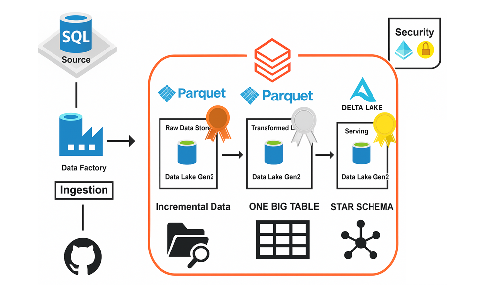

# Car-Sales-Data-Engineering-Project

Welcome to the **Azure Data Engineering Bootcamp Project**, where I have built a **real-world, production-ready, end-to-end data pipeline** using the latest Azure technologies.

This project focuses on **incremental data loading, Medallion architecture, star schema modeling, and data governance** using Azure Data Factory, Azure Data Lake, Azure SQL Database, Databricks, and Unity Catalog.

---

## 📂 Table of Contents

* [Project Overview](#project-overview)
* [Tech Stack](#tech-stack)
* [Project Architecture](#project-architecture)
* [Key Features](#key-features)
* [Data Flow](#data-flow)
* [Tools and Services Used](#tools-and-services-used)
* [Setup and Execution](#setup-and-execution)
* [Project Highlights](#project-highlights)
* [Learnings](#learnings)
* [Future Enhancements](#future-enhancements)
* [Contact](#contact)

---

## 🌟 Project Overview

This project is designed to simulate **real-time data engineering scenarios** using Azure's modern data stack.
It demonstrates:

* **Incremental Data Loading Pipelines**
* **Dimensional Data Modeling (Star Schema)**
* **Handling Slowly Changing Dimensions (Type 1)**
* **Data Governance with Unity Catalog**
* **Medallion Architecture (Bronze, Silver, Gold Layers)**
* **Parameterization for Production-Ready Pipelines**

---

## 🛠 Tech Stack

* **Azure Data Factory:** Data ingestion, orchestration, and pipeline management.
* **Azure SQL Database:** Source data storage.
* **Azure Data Lake Storage Gen2:** Data lake storage for raw, processed, and curated data.
* **Azure Databricks:** Data transformation using PySpark and Delta Lake.
* **Unity Catalog:** Data governance and access management.
* **Power BI (Optional):** Data visualization.

---

## 🏗️ Project Architecture



```plaintext
[GitHub Data Source] 
        |
        ▼
[Azure Data Factory] ---> Ingests data into ---> [Bronze Layer - Azure Data Lake (Raw Data)]
        |
        ▼
[Azure Databricks] ---> Processes data ---> [Silver Layer - Azure Data Lake (Transformed Data)]
        |
        ▼
[Azure Databricks] ---> Creates Star Schema & Handles SCD ---> [Gold Layer - Curated Data]
        |
        ▼
[Unity Catalog] ---> Data Governance, Quality Checks, Lineage Tracking
        |
        ▼
[Power BI] (Optional) ---> Visualizations
```

---

## ✨ Key Features

* ✅ End-to-End Azure Data Engineering Pipeline
* ✅ Medallion Architecture: Bronze, Silver, Gold layers
* ✅ Incremental Data Loading using Change Data Capture (CDC)
* ✅ Star Schema Design and Dimensional Modeling
* ✅ Slowly Changing Dimension (Type 1 - Upsert)
* ✅ Parameterized Pipelines (Production-Ready)
* ✅ Data Governance using Unity Catalog
* ✅ Automated and Scalable Solution

---

## 🔄 Data Flow

1. **Source Data:** GitHub-hosted CSV files.
2. **Azure SQL Database:** Source system simulating on-premises data.
3. **Azure Data Factory:** Ingests incremental data into the Bronze Layer.
4. **Azure Databricks:** Processes data to Silver and Gold Layers.
5. **Unity Catalog:** Governs data access, provides catalog lineage, and ensures data quality.
6. **Power BI (Optional):** Connects to Gold Layer for visualization.

---

## 🧰 Tools and Services Used

* Azure Data Lake Storage Gen2
* Azure SQL Database
* Azure Data Factory
* Azure Databricks (Delta Lake)
* Unity Catalog
* GitHub (Data Source)
* Power BI (Optional)

---

## ⚙️ Setup and Execution

### Prerequisites:

* Azure Subscription (Free or Paid)
* GitHub Repository Access (where the data files are stored)
* Basic understanding of Azure Data Factory and Databricks

### Steps:

1. **Create Azure Resources:**

   * Azure SQL Database
   * Azure Data Factory
   * Azure Data Lake Storage Gen2
   * Azure Databricks Workspace
2. **Upload Source Data:**

   * Load data from GitHub to Azure SQL Database.
3. **Build Pipelines:**

   * Create initial load and incremental load pipelines in Azure Data Factory.
4. **Configure Databricks:**

   * Set up Databricks notebooks for Bronze to Silver and Silver to Gold transformations.
5. **Implement Unity Catalog:**

   * Set up Unity Catalog for data governance and lineage tracking.
6. **Optional: Power BI Integration**

   * Connect to Databricks Gold Layer for dashboards.

---

## 🚀 Project Highlights

* 🔹 **Automated Incremental Data Pipeline**
* 🔹 **CDC-based Data Movement**
* 🔹 **Efficient Use of Delta and Parquet Formats**
* 🔹 **Dynamic and Parameterized Pipelines**
* 🔹 **Robust Data Quality and Governance**
* 🔹 **Production-Ready Design**

---

## 🎯 Learnings

* Real-world Medallion Architecture implementation
* Incremental loading using Lookup, CDC, and Watermarking
* Star Schema and Dimensional Modeling with Azure Databricks
* Data Governance using Unity Catalog
* Parameterization and scalability in Azure Data Factory
* Handling Slowly Changing Dimensions (SCD Type 1)

---

## 🌱 Future Enhancements

* Integrate **Azure Synapse Analytics** for more advanced processing.
* Implement **Data Quality Checks** using Azure Data Factory pipelines.
* Explore **Streaming Data** pipelines using Azure Event Hubs.
* Build **Advanced Power BI Dashboards**.
* Automate **CI/CD using Azure DevOps**.

---
